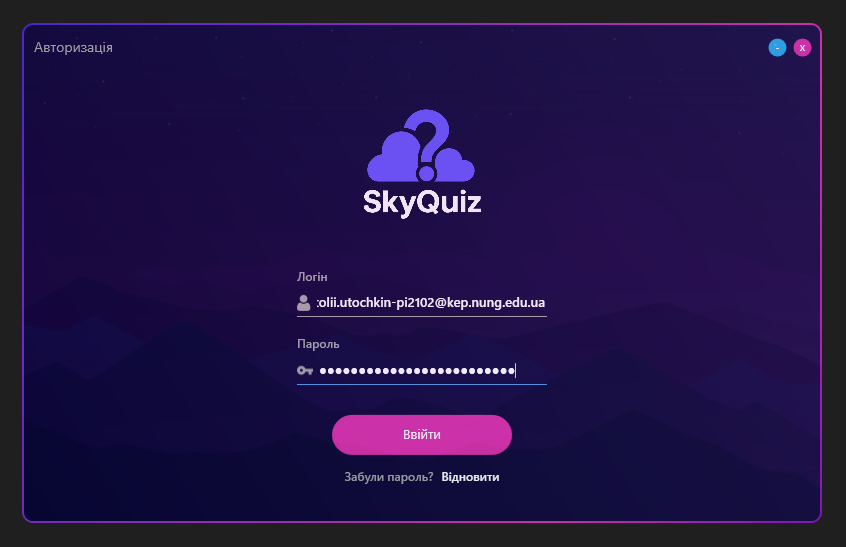
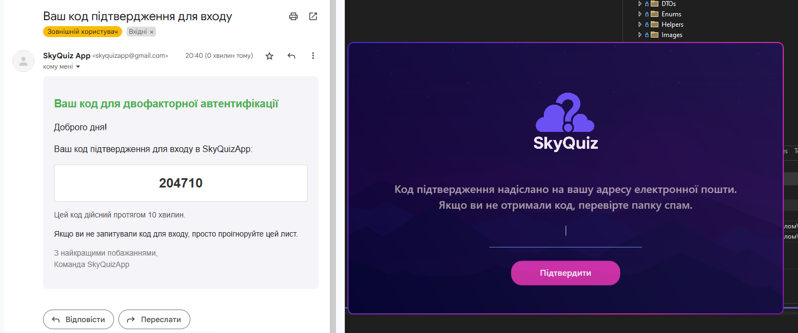
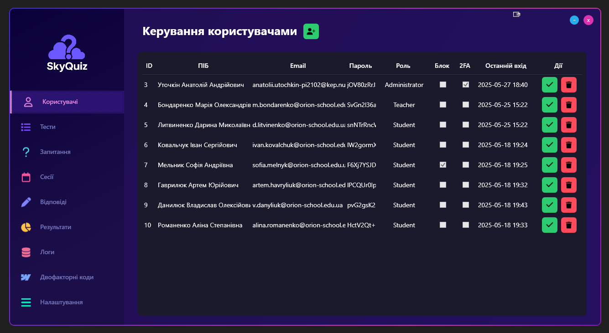
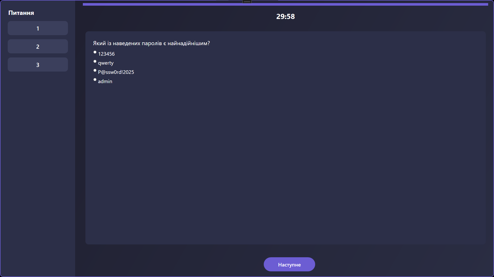
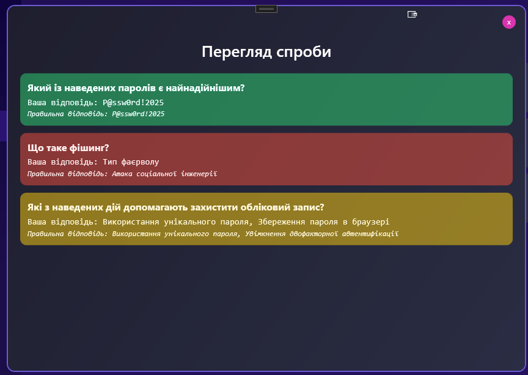
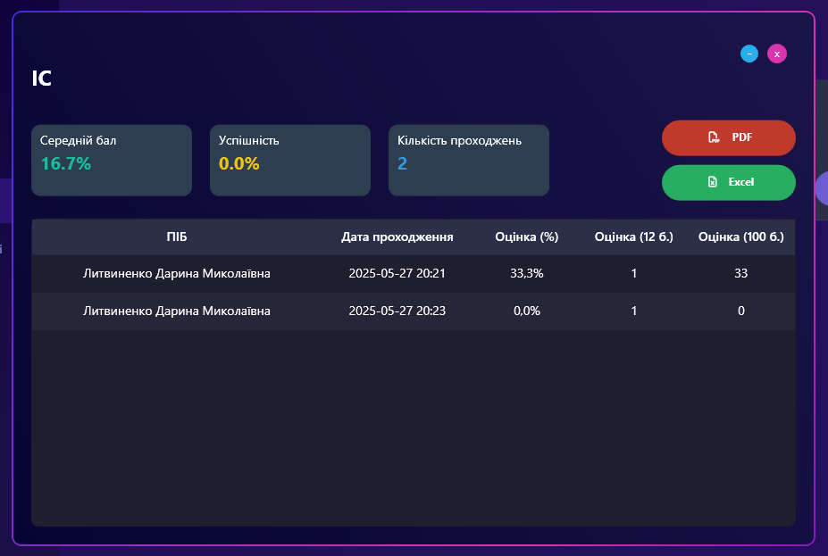

<div align="left" style="position: relative;">

<h1>SkyQuizApp</h1>
<p align="left">Built with the tools and technologies:</p>
<p align="left">
	
	
	
	
	
	
	
	
</p>
</div>

## 🔗 Table of Contents

- [📍 Overview](#-overview)
- [👾 Features](#-features)
- [📁 Project Structure](#-project-structure)
- [🚀 Getting Started](#-getting-started)
- [🎗 License](#-license)
- [🙌 Acknowledgments](#-acknowledgments)
- [📸 Screenshots](#-screenshots)

## 📍 Overview

**SkyQuizApp** is a desktop application designed for knowledge testing among students and learners in various educational institutions. It allows creating quizzes with different types of questions, conducting personalized test sessions, automatically saving answers, and generating results.

The application features a dark-themed, intuitive interface that adapts to the user’s role — student, teacher, or administrator. Its main goal is to provide a **convenient, secure, and functional tool** for testing knowledge without complex setup or reliance on external platforms.

SkyQuizApp supports:
- **Creation of quizzes** with multiple question types (single choice, multiple choice, open-ended)
- **Role-based access control** for students, teachers, and administrators
- **Secure data storage** using Azure SQL, EF Core, and hashed passwords
- **Analytics and export** of results to PDF and Excel
- **Responsive and modular design**, allowing easy expansion of features

The project was developed using **C# and .NET**, with **WPF** for the interface, **Entity Framework Core** and **LINQ** for database management, and **Visual Studio** as the main IDE. Code versioning was handled via **Git** and hosted on **GitHub**.

SkyQuizApp provides a **lightweight, local, and fully functional alternative** to online quiz platforms, combining flexibility, usability, and safety in one desktop application.


## 👾 Features

SkyQuizApp offers a wide range of features to facilitate knowledge testing:

- **Quiz Creation** – create quizzes with multiple types of questions: single choice, multiple choice, and open-ended.
- **Role-Based Access** – different functionalities for students, teachers, and administrators.
- **Secure Authentication** – hashed passwords (PBKDF2) and two-factor authentication via email.
- **Test Sessions** – personalized test sessions with timers and attempt limits.
- **Results Storage** – automatically save answers and test attempts.
- **Analytics & Reports** – generate summaries, statistics, and visualizations in tables, charts, PDF, and Excel.
- **Dynamic Question Templates** – automatic adaptation of the UI to the question type (RadioButton, CheckBox, TextBox).
- **Modular & Scalable Architecture** – MVVM pattern enables easy maintenance and feature expansion.
- **Offline Usage** – fully local application, no need for external servers.
- **Logging & Debugging** – integrated logging using Serilog for tracking events and errors.
- **Visual & UI Customization** – dark theme, intuitive layout, and reusable XAML templates for consistent styling.

## 📁 Project Structure

```sh
└── SkyQuizApp/
    ├── App.xaml
    ├── App.xaml.cs
    ├── AssemblyInfo.cs
    ├── Commands
    │   └── RelayCommand.cs
    ├── Configurations
    │   └── SmtpSettings.cs
    ├── Converters
    │   ├── AttemptsLimitConverter.cs
    │   ├── BoolToVisibilityConverter.cs
    │   ├── DictionaryValueConverter.cs
    │   ├── IntToVisibilityConverter.cs
    │   ├── QuestionTypeToTextConverter.cs
    │   ├── SelectedAnswerEqualityConverter.cs
    │   └── TrueFalseTextToAnswerIdConverter.cs
    ├── DTOs
    │   ├── LoginResult.cs
    │   ├── StudentActivityDto.cs
    │   ├── StudentResultDto.cs
    │   ├── StudentTestInfoDto.cs
    │   └── StudentTestResultDto.cs
    ├── Data
    │   ├── AppDbContext.cs
    │   └── DesignTimeDbContextFactory.cs
    ├── Enums
    │   ├── LogAction.cs
    │   ├── LoginFailureReason.cs
    │   ├── QuestionType.cs
    │   └── UserRole.cs
    ├── Helpers
    │   └── PasswordBoxAssistant.cs
    ├── Images
    │   ├── background.jpg
    │   ├── cloud.ico
    │   ├── email-icon.png
    │   ├── key-icon.png
    │   ├── logo.ico
    │   ├── logo.png
    │   └── user-icon.png
    ├── Migrations
    │   ├── 20250518185218_InitialCreate.Designer.cs
    │   └── 20250518185218_InitialCreate.cs
    ├── Models
    │   ├── Answer.cs
    │   ├── Log.cs
    │   ├── Question.cs
    │   ├── Result.cs
    │   ├── Test.cs
    │   ├── TestSession.cs
    │   ├── TwoFactorCode.cs
    │   ├── User.cs
    │   └── UserAnswer.cs
    ├── README.md
    ├── Services
    │   ├── AuthService.cs
    │   ├── EmailService.cs
    │   ├── Interfaces
    │   ├── LogService.cs
    │   ├── LoggerConfig.cs
    │   ├── PasswordHasher.cs
    │   ├── ResetPasswordService.cs
    │   ├── TwoFactorService.cs
    │   ├── UserSessionService.cs
    │   ├── WindowHelper.cs
    │   └── WindowService.cs
    ├── SkyQuizApp.csproj
    ├── SkyQuizApp.sln
    ├── Styles
    │   ├── ButtonStyles.xaml
    │   └── UIColors.xaml
    ├── ViewModels
    │   ├── Admin
    │   ├── Auth
    │   ├── Student
    │   └── Teacher
    └── Views
        ├── Admin
        ├── Auth
        ├── Student
        └── Teacher
```

## 🚀 Getting Started

### ☑️ Prerequisites

Before getting started with SkyQuizApp, ensure your development environment meets the following requirements:

#### System Requirements:
- **Operating System:** Windows 10 or higher (64-bit recommended)
- **Development Environment:** Visual Studio 2022 (Community, Professional, or Enterprise edition) with the following workloads:
  - .NET desktop development
  - Entity Framework Core tools
  - WPF development
- **.NET Runtime:** .NET 6.0 SDK or later installed
- **Database:** Access to Azure SQL Database or a local SQL Server instance


### ⚙️ Installation

Install SkyQuizApp using one of the following methods:

**Build from source:**

1. Clone the SkyQuizApp repository:
```sh
❯ git clone https://github.com/AnatoliiUtochkin/SkyQuizApp
```

2. Navigate to the project directory:
```sh
❯ cd SkyQuizApp
```

3. Install the project dependencies:


```sh
❯ dotnet restore
```

### 🤖 Usage
Run SkyQuizApp using the following command:

```sh
❯ dotnet run
```

## 🎗 License

This project is licensed under the [MIT License](https://choosealicense.com/licenses/mit/).  
For full details, please see the [LICENSE](LICENSE) file.


## 🙌 Acknowledgments
- Inspiration and design references from Figma UI kits.
- Libraries used in the project: FontAwesome, LiveCharts, PDFsharp, ClosedXML, Serilog.
- Special thanks to the course instructors and classmates for feedback during project development.

## 📸 Screenshots

<table>
  <tr>
    <td></td>
    <td></td>
    <td></td>
  </tr>
  <tr>
	<td></td>
    <td></td>
    <td></td>
  </tr>
</table>
